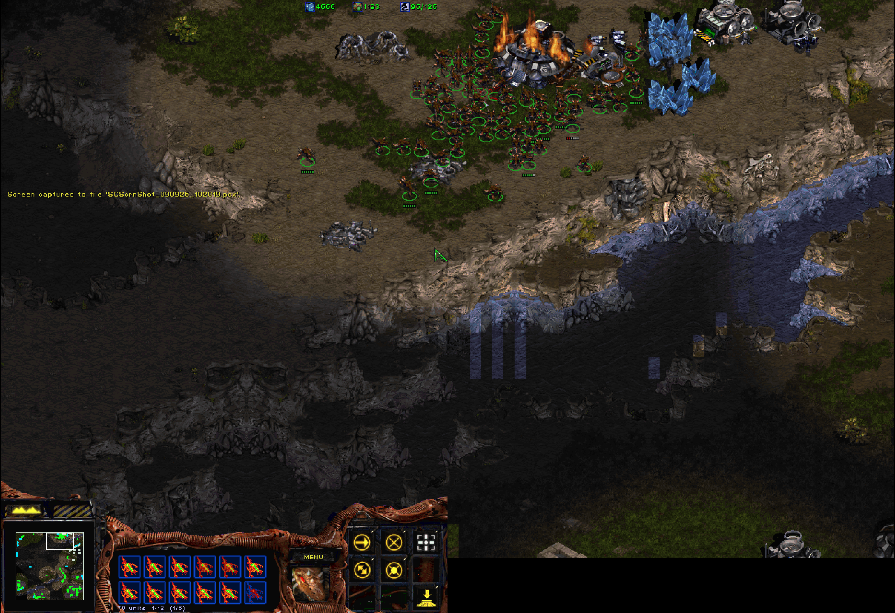
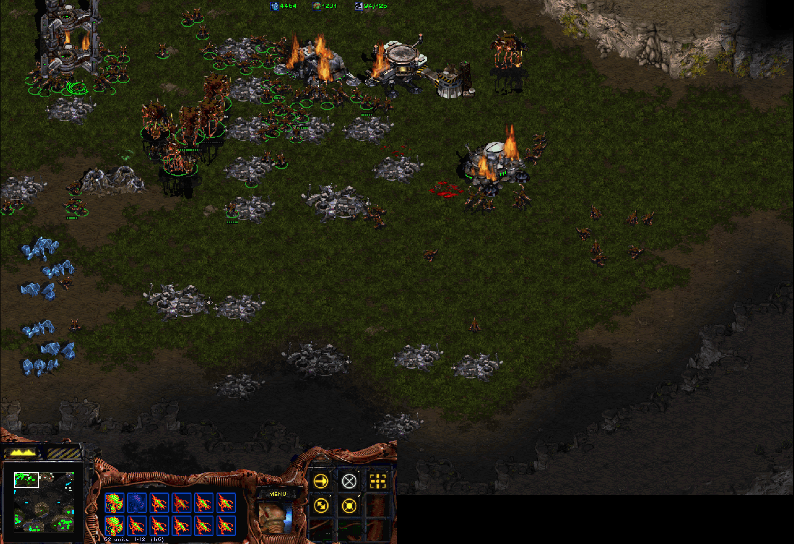

# decompile-sc

StarCraft: Brood War 1.16.1 reverse-engineering research, and a gameplay mod built on it.

The mod is a 32-bit DLL injected at launch. The game files on disk stay byte-identical; every
change is applied in memory. Offline and single-player only.





## What the mod changes in the game

1. **Select more than 12 units.** A drag box keeps every unit it covers, and an order reaches all of them.
2. **A selection circle under every selected unit**, not only the first 12.
3. **The bottom HUD row pages through the whole selection** (`70 units 1-12 (1/6)`; right-click the row to flip pages).
4. **Control groups hold more than 12 units.** Ctrl+1 on a 70-unit army recalls all 70.
5. **Abilities reach every unit in the selection** (Stim, Burrow), each unit paying its own cost.
6. **Box-select several buildings of one type.** Stock selects one building per box.
7. **One Train click queues a unit at every selected production building.**
8. **Production queue past 5 per building** (16 by default, up to 24). A `+N` badge on the fifth slot shows the overflow; clicking it cancels one and refunds.
9. **More than one upgrade or research queued at a building.**
10. **Widescreen.** 1280x880 screen with a 1280x800 playfield (twice the stock 640x400 in both axes), console at the bottom, fog and tooltips corrected for the bigger frame. Presented through [cnc-ddraw](https://github.com/FunkyFr3sh/cnc-ddraw) at 2x window scale with the cursor locked to the window (Ctrl or Right Alt frees it).
11. **Save and load work with everything above on.**

Every feature has its own off switch (`tools/plugin/run-with-plugin.ps1` parameters); the
deployed desktop shortcut turns all of them on. How each one works, with the addresses and
how they were verified, is in `research/` and `tools/plugin/README.md`.

## Running it yourself

You need your own StarCraft 1.16.1 install; nothing from the game is in this repo.

1. Windows, PowerShell 7, git. `./setup.ps1` checks these and creates the Python venv (Python 3.11+, only for the map tooling).
2. The pinned 32-bit MinGW-w64 toolchain: `tools/plugin/README.md` "Toolchain (pinned)".
3. `./tools/make-working-copy.ps1` copies your install to `C:\sc-work\1161-base` and checks its hashes.
4. `./tools/plugin/fetch-cnc-ddraw.ps1` downloads the pinned presenter DLL.
5. `./tools/deploy.ps1` builds the plugin, assembles a self-contained modded copy under `C:\sc-deploy`, and puts a **StarCraft Modded** shortcut on the desktop.

`./run.ps1` launches the game from the current checkout instead (dev loop).

## Layout

```
research/   per-subsystem findings -- the product of this repo
tools/      plugin, Ghidra automation, map + deploy tooling
tests/      Pester tests for the tooling
docs/       README screenshots
work/       scratch/ (ignored build output + logs), defects/ (patches for build-defect-arm.ps1)
```

Hard rule: no game binaries or assets in this repo. Research notes, scripts, and findings only.
See [AGENTS.md](AGENTS.md) for the rulebook.
